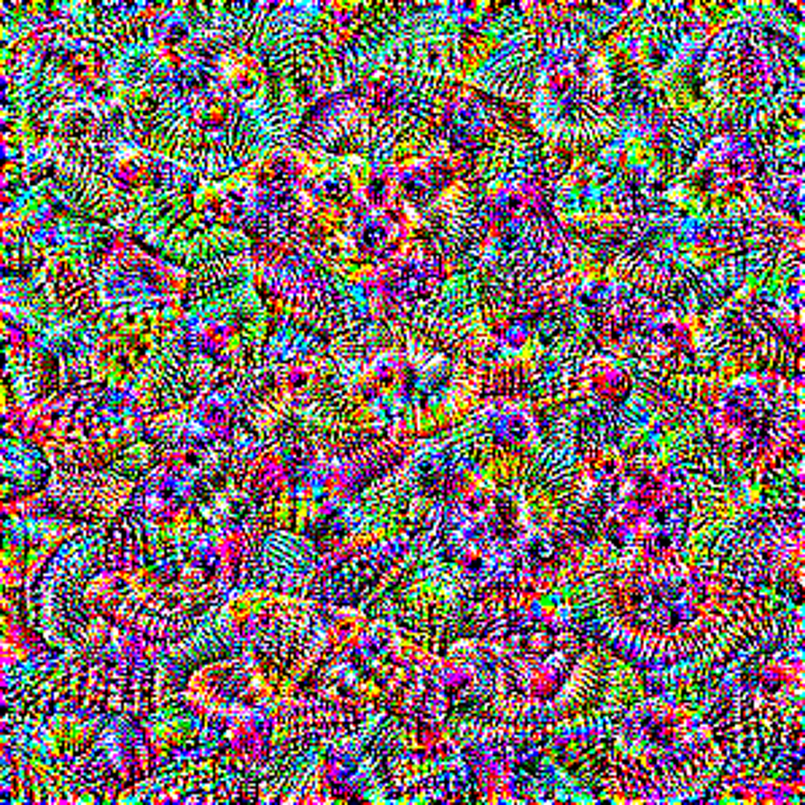

# Deep Dream
Deep Dream is a fascinating technique that uses convolutional neural networks to generate artistic and trippy images. It was introduced by Google in 2015 and quickly gained popularity for its ability to transform ordinary photos into surreal masterpieces. One of the most widely used neural networks for Deep Dream is InceptionV3, a pre-trained model that excels in image recognition tasks.

|  |  |
|:--:|:--:|
| *Original image* | *Generated image* |

